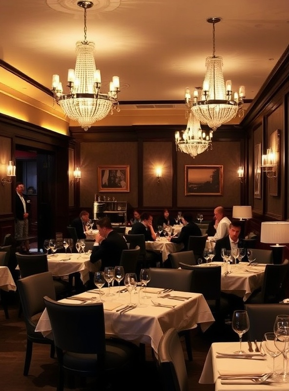
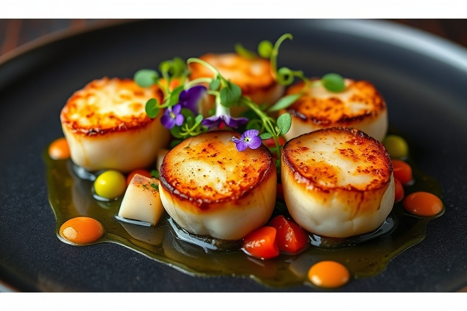

 <!--story-->
    <section class="story">
        

            

                

                    
Our Story

                    

                        Founded in 2010 by Chef Michael Laurent, Saveur has been dedicated to creating unforgettable
                        dining experiences that blend traditional techniques with modern innovation. Our commitment to
                        using only the finest seasonal ingredients sourced from local farmers ensures that each dish
                        tells a story of passion and craftsmanship.
                    

                    
Over the years, we've earned a reputation for culinary excellence, receiving
                        numerous accolades
                        including three Michelin stars and being named among the World's 50 Best Restaurants for five
                        consecutive years.

                    

                        
<i class="fa-solid fa-medal"></i>

                        

                            
Award-Winning Cuisine

                            
Three-time Michelin Star recipient

                        

                    

                

                

                    
                

            

        

    </section>

    <!-- menu-highlight -->
    <section class="menu-part mt-[50px]">
        

            
Menu Highlights

            
Discover our chef's carefully crafted selection of dishes that showcase the finest
                seasonal ingredients and innovative culinary techniques.

            

                

                    <article class="card">
                        

                            
                        

                        

                            

                                
Seared Atlantic Scallops

                                
$32

                            

                            
Hand-dived scallops seared to perfection, served with
                                cauliflower
                                purée, black truffle, and champagne foam.

                        

                    </article>
                    <article class="menu-items">
                        

                    </article>
                    <article class="menu-items">
                        

                    </article>
                

            

        

    </section>